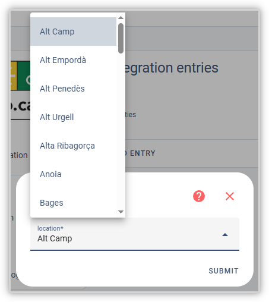

# homeassistant-meteocat

Esta integración para Home Assistant te permite integrar la previsión meteorológica emitida por Meteocat (la agencia meteorológica local de Catalunya) a través del portal de datos abiertos de la Generalitat de Catalunya.

La integración está todavía en desarrollo y no está lista para su uso productivo.

## Índice de contenidos

1. [Ejemplo de Dashboard](#Ejemplo-de-Dashboard) 
2. [Instalación](#Instalación) 
3. [FAQ](#FAQ)

## Ejemplo de Dashboard

## Instalación

1. Accede a la carpeta de config de tu home assistant.
2. Crea la carpeta "custom_components/meteocat"
3. Copia el contenido del repositorio en esa carpeta.
4. Reinicia home assistant desde "Developer Tools / Yaml / Check and Restart / Restart"
5. Accede a "Settings / Devices and Services / Integrations / Add integration.
6. Localiza la integración de "Meteocat".

Configuración:

Selecciona la comarca para la que quieres recibir la previsión meteorológica:

## FAQ

**xxx**

> xxx.
