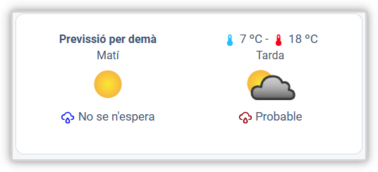

[](https://github.com/fxreina/homeassistant-meteocat/releases/latest)

# homeassistant-meteocat
<a href="https://www.meteo.cat/" target="_blank"></a> 

This integration for Home Assistant allows you to incorporate the weather forecast provided by Meteocat (the local meteorological agency of Catalonia) through the open data portal of the Generalitat de Catalunya. Specifically, it queries the service https://static-m.meteo.cat/content/opendata/ctermini_comarcal.xml, which provides the regional weather forecast for the next two days (the current day == today and the following day == tomorrow).

The integration is still under development and is not ready for productive use.

## Table of Contents

1. [Installation](#Installation)<br>
2. [Quick Start](#Quick-Start)<br>
3. [Examples](#Examples)<br>

## Installation

1. Copy contents of custom_components/meteocat/ to custom_components/meteocat/ in your Home Assistant config folder.
4. Restart Home Assistant from "Developer Tools / Yaml / Check and Restart / Restart"
5. Get into "Settings / Devices and Services / Integrations / Add integration".
6. Find the "Meteocat" custom integration and install it.

Configuration:

Select the region (Comarca) for which you want to receive the weather forecast.


### Installation using HACS
[HACS](https://github.com/custom-components/hacs) is a community store for Home Assistant. Although it is planned to solve this in future, for the time being you CANNOT install yet this Meteocat integration from the HACS store.

## Quick Start
This custom component creates two sensors that will deliver the weather forecast for today and tomorrow for the selected region.


Each sensor will have attributes showing the max and min forecasted temperatures and the probability and intensity of precipitation splitted by morning and afternoon.


## Examples

### Using a custom button card
Showing in this case next available forecast, that can be either today's forecast or tomorrow's. Meteocat pubishes today's forecast as day1 until noon, then day1 will shift to be tomorrow.
  


```yaml
type: custom:button-card
entity: sensor.meteocat_forecast_valles_occidental_day1
show_icon: false
show_state: false
show_label: false
show_name: false
name: null
label: Propera previssió
styles:
  card:
    - padding: 3%
    - height: 200px
  state:
    - font-weight: bold
    - font-size: 22px
  label:
    - align-self: middle
    - justify-self: left
  grid:
    - grid-template-areas: |
        "daylabel trange"
        "moricon afticon"
        "mprecip tprecip"
    - grid-template-columns: 50% 50%
    - grid-template-rows: 25% 50% 5%
custom_fields:
  trange: |
    [[[
      const minTemp = states['sensor.meteocat_forecast_valles_occidental_day1'].attributes.min_temp;
      const maxTemp = states['sensor.meteocat_forecast_valles_occidental_day1'].attributes.max_temp;
      return `
      <ha-icon icon="mdi:thermometer" style="width: 20px; height: 20px; color: deepskyblue;"></ha-icon>
      <span style="color: var(--text-color-sensor);">${minTemp} ºC - </span>
      <ha-icon icon="mdi:thermometer" style="width: 20px; height: 20px; color: red;"></ha-icon>
      <span style="color: var(--text-color-sensor);">${maxTemp} ºC</span>
      `;    ]]]
  mprecip: |
    [[[
        const morPrecip = states['sensor.meteocat_forecast_valles_occidental_day1'].attributes.morning_precip;
      return `<ha-icon icon="mdi:weather-rainy" style="width: 20px; height: 20px; color: blue;"></ha-icon>
      <span style="color: var(--text-color-sensor);">${morPrecip}</span>`;
    ]]]  
  tprecip: |
    [[[
      const aftPrecip = states['sensor.meteocat_forecast_valles_occidental_day1'].attributes.afternoon_precip;
      return `<ha-icon icon="mdi:weather-rainy" style="width: 20px; height: 20px; color: darkred;"></ha-icon>
      <span style="color: var(--text-color-sensor);">${aftPrecip}</span>`;
    ]]]  
  moricon: |
    [[[
      const iconMorning = states['sensor.meteocat_forecast_valles_occidental_day1'].attributes.icon_morning;
      return iconMorning ? `
        <div style="text-align: center;">
          <div style="font-size: 16px; margin-top: 8px; margin-bottom: 4px;">Matí</div>
          
        </div>` : '';
    ]]]
  afticon: |
    [[[
      const iconAfternoon = states['sensor.meteocat_forecast_valles_occidental_day1'].attributes.icon_afternoon;
      return iconAfternoon ? `
          <div style="text-align: center;">
          <div style="font-size: 16px; margin-top: 8px; margin-bottom: 4px;">Tarda</div>
          
        </div>` : '';
    ]]]
  daylabel: |
    [[[
      const dateStr = states['sensor.meteocat_forecast_valles_occidental_day1'].attributes.date;
      const forecastDate = new Date(dateStr);
      const today = new Date();
      // Normalize both dates to midnight to ignore time
      forecastDate.setHours(0, 0, 0, 0);
      today.setHours(0, 0, 0, 0);
      const label = forecastDate.getTime() === today.getTime() ? "Previsió per avui" : "Previssió per demà";
      return `<div style="text-align:center; font-size: 16px; font-weight: bold; color: var(--primary-text-color);">${label}</div>`;
    ]]]
  ```

> xxx.
